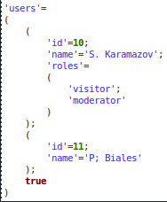
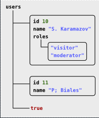
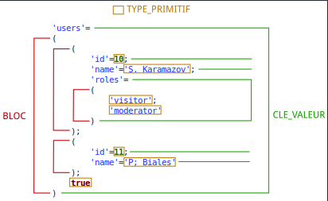

# CodinGame: Indentation CGX

## Que vais-je apprendre ?

Ce puzzle vous permet de maîtriser la manipulation de chaînes une bonne fois pour toutes. Vous pouvez utiliser des expressions régulières (regex) pour trouver des motifs.

**Ressources externes: [Regex 101](https://regex101.com/), [Expression régulière](https://fr.wikipedia.org/wiki/Expression_r%C3%A9guli%C3%A8re)**

## ÉNONCÉ

Vous devez formater un fichier d'entrée vers un format JSON-like. Vous devrez appliquer des règles d'indentation et lire l'énoncé avec précaution. Utilisez des expressions régulières afin de trouver des motifs, pour analyser le contenu et décider de son format.

## Histoire

Chez CodinGame on aime réinventer la roue. XML, JSON etc. c'est bien mais pour un web meilleur nous avons inventé notre propre format de données textuelles (nommé CGX) pour représenter de l'information structurée.

Pour ce défi, il vous sera demandé d'écrire un programme capable d'identifier des blocs de texte en respectant les règles de formatage CGX.

## Objectif

Voici un exemple de données structurée à la CGX :​

- Exemple de contenu CGX formaté:


- Représentation graphique de l'exemple:


Un contenu CGX est composé d'ELEMENTs.

**ELEMENT**
Un ELEMENT peut être de type `BLOC`, `TYPE_PRIMITIF` ou `CLE_VALEUR`.

**BLOC**
Suite d'`ELEMENT`s séparés par le caractère ;
Un `BLOC` commence par le marqueur **(** et se termine par le marqueur **)**.

**TYPE_PRIMITIF**
Un nombre, un booléen, null, ou une chaîne de caractères (entourée par le marqueur **'**)

**CLE_VALEUR**
Une chaîne de caractères séparée d'un `BLOC` ou d’un `TYPE_PRIMITIF` par le caractère **=**



Votre mission: écrire un programme capable de formater un contenu CGX pour le rendre lisible !

​En dehors des règles ci-dessous, le résultat affiché ne contiendra aucun espace, tabulation ou retour chariot. Aucune autre règle ne devra être ajoutée.
- Le contenu des chaînes de caractères ne doit pas être modifié.
- Un `BLOC` commence sur sa propre ligne.
- Les marqueurs de début et de fin d'un `BLOC` sont sur la même colonne.
- Chaque `ELEMENT` contenu dans un `BLOC` est indenté de 4 espaces par rapport au marqueur de ce `BLOC`.
- Une `CLE_VALEUR` commence sur sa propre ligne.
- Un `TYPE_PRIMITIF` commence sur sa propre ligne sauf s'il est la valeur d'une `CLE_VALEUR`.

### Entrées

- **Ligne 1:** Le nombre `N` de lignes CGX à formater.
- **Les `N` lignes suivantes:** Le contenu CGX. Chaque ligne contient 1000 caractères maximum. Tous les caractères sont ASCII.

### Sortie
Le contenu CGX formaté
### Contraintes
- Le contenu CGX fourni sera toujours valide.
- Les chaînes de caractères ne contiennent pas de caractère `'`
- 0 ≤ `N` < 10000

### Exemples
- Cas 1: 
+ Entrée
```json
4
  

	 true
```
+ Sortie:
```json
true
```

- Cas 2: 
+ Entrée
```json
1
' Content with spaces and	tabs'
```
+ Sortie:
```json
' Content with spaces and	tabs'
```

- Cas 3: 
+ Entrée
```json
1
(0)
```
+ Sortie:
```json
(
    0
)
```

- Cas 4: 
+ Entrée
```json
1
()
```
+ Sortie:
```json
(
)
```

- Cas 5: 
+ Entrée
1
(0;1;2)
```
+ Sortie:
```json
(
    0;
    1;
    2
)
```

- Cas 6: 
+ Entrée
```json
1
(('k1'=1);('k2'=2))
```
+ Sortie:
```json
(
    (
        'k1'=1
    );
    (
        'k2'=2
    )
)
```

- Cas 7: 
+ Entrée
```json
10
'users'=(('id'=10;
'name'='Serge';
'roles'=('visitor';
'moderator'
));
('id'=11;
'name'='Biales'
);
true
)
```
+ Sortie:
```json
'users'=
(
    (
        'id'=10;
        'name'='Serge';
        'roles'=
        (
            'visitor';
            'moderator'
        )
    );
    (
        'id'=11;
        'name'='Biales'
    );
    true
)
```

- Cas 8: 
+ Entrée
```json
9
( 'user'= (
    'key'='1= t(c)(';
    'valid'=false
  );
  'user'= (
    'key'=' = ; ';
    'valid'= true
  ); ()
​)
```
+ Sortie:
```json
(
    'user'=
    (
        'key'='1= t(c)(';
        'valid'=false
    );
    'user'=
    (
        'key'=' = ; ';
        'valid'=true
    );
    (
    ​)
​)
```

[Code source de la solution](https://github.com/Kous92/CodinGame-Swift-FR-/tree/main/Puzzles%20classiques/Difficile/Indentation%20CGX/indentationCGX.swift)