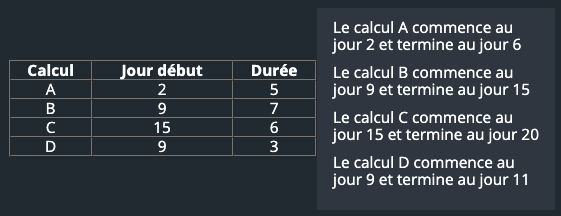

# CodinGame: Super calculateur

## Que vais-je apprendre ?

Ce puzzle utilise des algorithmes de tri, et algorithmes gloutons. Vous devrez créer un programme performant afin de passer tous les cas d'essais.

**Ressources externes: [Tri](https://fr.wikipedia.org/wiki/Algorithme_de_tri), [Tableau associatif](https://fr.wikipedia.org/wiki/Tableau_associatif), [Algorithme glouton](https://fr.wikipedia.org/wiki/Algorithme_glouton), [Complexité en temps](https://fr.wikipedia.org/wiki/Complexit%C3%A9_en_temps)**

## ÉNONCÉ

Le but de ce puzzle est de créer le planning d'utilisation d'un super ordinateur, afin que le plus possible d'expériences puissent être réalisées. Gardez à l'esprit qu'une solution efficace n'est parfois pas si complexe, une fois que le problème est tourné de la bonne façon.

## Histoire

Le département de recherche de votre université a fait récemment l'acquisition d'un magnifique super calculateur. Seulement voilà, tout le monde veut l'utiliser. Un chercheur du labo de chimie veut réaliser une série de calculs d'une semaine, votre collègue Martin voudrait y accéder pour "juste un petit truc qui prend pas de temps, c'est promis", etc... Bref, cela ne va pas être chose aisée d'organiser l'emploi du temps de cette machine.

A vous de planifier quels seront l'ordre et le nombre d'expériences qui tourneront sur le calculateur pour permettre au maximum de demandes d'être satisfaites.

## Objectif

Dans le centre de calcul Computer2000 c'est vous qui planifiez l'utilisation d'un super calculateur pour des scientifiques. Le problème avec les scientifiques c'est qu'ils souhaitent tous lancer des calculs sur le super calculateur quand bon leur semble et que, évidemment, vous ne pouvez pas toujours satisfaire tout le monde.

​Vous avez donc décidé de mettre un peu d'ordre en planifiant les tâches des uns et des autres. La logique est simple : plus le nombre de calculs pouvant être effectués est élevé, plus vous pourrez satisfaire du monde.

## Règles

Les scientifiques vous fournissent le jour de début de leur calcul et le nombre de journées consécutives de location dont ils ont besoin.

- Par exemple :

 
Dans cet exemple il n'est pas possible de réaliser tous les calculs parce que les périodes de B et C se chevauchent. 3 calculs au maximum pourront être effectués : A, D et C.

## Entrées du jeu

### Entrée

- **Ligne 1:** Le nombre `N` de calculs.
- **Les `N` lignes suivantes:** Sur chaque ligne, le jour `J` de début et la durée `D` de location, séparés par un espace.

### Sortie
Le nombre maximum de calculs qui pourront être effectués.

### Contraintes
- 0 < `N` < 100000
- 0 < `J` < 1000000
- 0 < `D` < 1000

### Exemples

Entrée | Sortie
------------ | -------------
4 2 5 9 7 15 6 9 3 | 3

Entrée | Sortie
------------ | -------------
5 3 5 9 2 24 5 16 9 11 6 | 4

[Code source de la solution](https://github.com/Kous92/CodinGame-Swift-FR-/tree/main/Puzzles%20classiques/Difficile/Super%20calculateur/superCalculateur.swift)