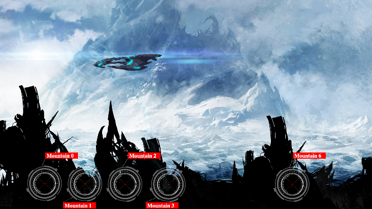

# CodinGame: La descente

## Que vais-je apprendre ?

Résoudre ce puzzle vous fait comprendre le concept de boucle et comment trouver le maximum d'une liste d'entiers.

Ce puzzle est aussi un terrain de jeu pour tester le concept de tri en utilisant jusqu'à 25 langages de programmation. Enfin il vous fait découvrir la programmation fonctionnelle.

**Tutoriels vidéo**:
▶️ [La Descente en Python 3](https://www.youtube.com/watch?v=Oa4Ups106jA) par [Foxxpy](https://www.codingame.com/profile/2d6e4b70f304fd6b2c6a7412b7cb80ac1060643)
▶️ [La Descente en Java](https://www.youtube.com/watch?v=cTreOLAemko&t=140s) par [PochyPoch](https://www.codingame.com/profile/3f8df37d08dd800256b0b2438f9bde6c0375613)

**Ressources externes: [Tri](https://fr.wikipedia.org/wiki/Algorithme_de_tri), [Boucles](https://fr.wikipedia.org/wiki/Structure_de_contr%C3%B4le#Boucles), [La Descente](https://www.youtube.com/watch?v=t-tPMY9wdE8)**

## ÉNONCÉ

Un problème simple pour expérimenter la plateforme CodinGame : votre programme doit trouver la montagne la plus haute parmi une liste de montagnes.

## Histoire

Le *vaisseau Enterprise* est en danger : attiré vers le bas, il risque de s'écraser contre les montagnes d'une planète inconnue. Aidez Kirk et Spock à détruire les montagnes... sauvez l'*Enterprise* !

## Objectif

Écrivez le programme permettant de détruire les montagnes pour pouvoir attérir. Pour cela, tirez sur la montagne la plus haute.

## Règles
**Au début de chaque tour de jeu**, vous recevez en entrée la hauteur de chaque montagne de gauche à droite.
**Avant la fin du tour de jeu**, vous devez indiquer la montagne la plus haute pour tirer dessus.

Tirer sur une montagne ne fera qu'en détruire une partie. Votre vaisseau descend à chaque passe.

### 🏆 Conditions de victoire
Vous gagnez si vous détruisez la montagne la plus haute à chaque tour

### 💀 Conditions de défaite
- Votre vaisseau percute une montagne
- Vous fournissez une sortie invalide ou votre programme ne répond pas à temps

## Note

N'oubliez pas d'exécuter les tests depuis la fenêtre "Jeu de tests". Les tests fournis et les validateurs utilisés pour le calcul du score sont légèrement différents pour éviter les solutions codées en dur.

## Entrées du jeu

Le programme doit lire depuis l'entrée standard la hauteur des montagnes puis fournir sur la sortie standard l'indice de la montagne à détruire.

### Entrée pour un tour de jeu
- **8 lignes:** un entier `mountainH` par ligne. Il représente la hauteur d'une montagne. Les hauteurs des montagnes sont données dans l'ordre de leur index (allant de 0 à 7).

### Sortie pour un tour de jeu
Une **unique ligne** contenant le numéro de la montagne sur laquelle tirer
 
### Contraintes
- 0 ≤ `mountainH` ≤ 9
- Temps de réponse pour un tour ≤ 100ms

## Synopsis

*“Journal de bord du capitaine, date stellaire 1567.9. Nous pénétrons dans le système Deneb deux jours après avoir reçu un appel de détresse émanant de la planète XIV de ce système. Notre mission est de porter assistance à toute personne ayant besoin de notre aide.”*
 
*“Journal de bord du capitaine, annexe. Pendant la phase d'approche, notre vaisseau de secours a été attiré par une force invisible vers un point de la surface de la planète XIV. Malgré toutes nos tentatives, le vaisseau continue sa course vers le bas et nous nous trouvons en grand danger de percuter les montagnes qui se dressent devant nous.”*
 
*“Journal de bord du capitaine, annexe. Lors d'un ultime effort, Scotty a pu recalibrer les canons laser qui sont maintenant capables de détruire les montagnes à leur base. Cela nous donne espoir de pouvoir atterrir en sécurité sur la planète. Nous recherchons à présent un membre de l'équipage capable de programmer le circuit de commande de tir des canons pour nous sortir de ce qui apparait clairement comme un piége destiné à nous détruire.”*

[Code source de la solution](https://github.com/Kous92/CodinGame-Swift-FR-/blob/main/Puzzles%20classiques/Facile/La%20descente/laDescente.swift)