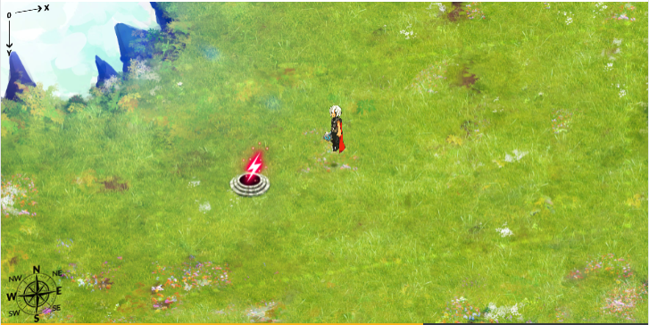
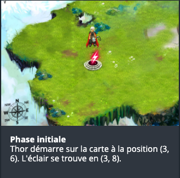
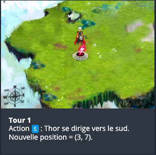
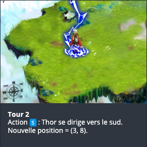

# CodinGame: Power of Thor - Episode 1

## Que vais-je apprendre ?

Dans ce puzzle il vous faut comparer différentes valeurs et mettre en corrélation des caractères et des entiers.
Une solution simple utilise 8 conditions. Il y a une façon de la simplifier à 4 conditions.

**Ressources externes: [Conditions](https://fr.wikipedia.org/wiki/Structure_de_contr%C3%B4le#Test_si)**

## ÉNONCÉ

Un problème de base pour aller un peu plus loin avec les conditions et les variables : votre programme doit permettre à Thor de rejoindre les coordonnées de l'éclair de puissance dans un champ en 2D.

## Histoire

Le marteau de Thor, *Mjöllnir*, a perdu tout pouvoir... Saurez-vous guider Thor vers l'éclair de puissance afin de redonner sa force au marteau ?

## Objectif

Votre programme doit permettre à Thor de rejoindre l'éclair de puissance.

## Règles

Thor évolue sur une carte de **40** cases de large et **18** cases de hauteur. Notez que les coordonnées (X et Y) commencent en partant du haut ! Ainsi la case la plus en haut à gauche a pour coordonnées "X=0,Y=0" et celle située le plus en bas à droite a pour coordonnées "X=39,Y=17".

Au début du programme vous recevez :
- la variable `lightX`: la position X de l'éclair que Thor doit rejoindre.
- la variable `lightY`: la position Y de l'éclair que Thor doit rejoindre.
- la variable `initialTX`: la position X initiale de Thor.
- la variable `initialTY`: la position Y initiale de Thor.
**À la fin du tour de jeu**, vous devez afficher la direction que Thor doit prendre parmi: 

### 🏆 Conditions de victoire
Vous gagnez lorsque Thor arrive sur l'éclair de puissance

### 💀 Conditions de défaite
Thor sort de la carte

- 1: Phase initiale 

- 2: Tour 1 

- 3: Tour 2 

## Note

N'oubliez pas d'exécuter les tests depuis la fenêtre "Jeu de tests".
**Attention:** les tests fournis et les validateurs utilisés pour le calcul du score sont légèrement différents pour éviter les solutions codées en dur

## Entrées du jeu

Le programme doit d'abord lire les données d'initialisation depuis l'entrée standard, puis, dans une boucle infinie fournir sur la sortie standard les instructions de mouvement de Thor.

### Entrées d'initialisation

- **Ligne 1:** 4 entiers `lightX` `lightY` `initialTX` `initialTY`. (`lightX`, `lightY`) indique la position de l'éclair. (`initialTX`, `initialTY`) indique la position initiale de Thor.

### Entrée pour un tour de jeu
- **Ligne 1:** le nombre de déplacements restant pour permettre à Thor de rejoindre l'éclair de puissance `remainingTurns`. Vous pouvez ignorer cette valeur mais vous devez la lire.

### Sortie pour un tour de jeu
Une **ligne unique** indiquant le mouvement à effectuer : `N` `NE` `E` `SE` `S` `SW` `W` ou `NW`

### Contraintes
- 0 ≤ `lightX` < 40
- 0 ≤ `lightY` < 18
- 0 ≤ `initialTX` < 40
- 0 ≤ `initialTY` < 18
- Temps de réponse pour un tour ≤ 100ms

## Synposis

**Mars Lander - NIVEAU 1 - PRISE DE CONTACT**

La bataille finale du *Ragnarök*, le crépuscule des dieux, approche... Vous incarnez *Thor* qui participe à cette lutte contre toutes les forces du mal menées par *Loki*, le frère sorcier de *Thor*.

*Thor* est sorti blessé d'un précédent combat l'opposant à Fenrir, le dieu-loup. Durant ce combat, *Loki*, profitant de la confusion, utilisa sa magie pour annihiler les pouvoirs magiques du marteau de *Thor*, *Mjöllnir*, en le séparant de son âme : l'éclair de puissance.

*Thor*, très affaibli, *doit au plus vite retrouver et atteindre l'éclair*, seul capable de restaurer les pouvoirs de *Mjöllnir* et de son maitre.

[Code source de la solution](https://github.com/Kous92/CodinGame-Swift-FR-/blob/main/Puzzles%20classiques/Facile/Power%20of%20Thor%20-%20Episode%201/powerOfThorEP1.swift)