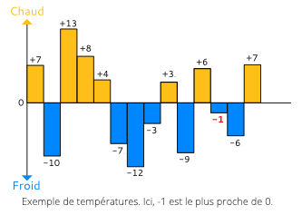

# CodinGame: Températures

## NOTE: Ce problème est également présent dans les tutoriels des tests recruteurs de la solution CodinGame for Work. ATTENTION: Le niveau est plus exigeant que sur la version grand public de CodinGame avec des validateurs plus stricts !

## ÉNONCÉ
Votre programme doit analyser des relevés de température pour trouver la plus proche de zéro

## Objectif
Dans cet exercice, vous devez analyser un relevé de températures pour trouver quelle température se rapproche le plus de zéro.

- **Exemple de températures**: Ici, -1 est le plus proche de 0. 

## Règles

Écrivez un programme qui affiche la température la plus proche de 0 parmi les données d'entrée. **Si deux nombres sont aussi proches de zéro, alors l'entier positif sera considéré comme étant le plus proche de zéro** (par exemple, si les températures sont -5 et 5, alors afficher 5).

## Entrées du jeu

Votre programme doit lire les données depuis l'entrée standard et écrire le résultat sur la sortie standard.

### Entrée
- **Ligne 1:** Le nombre `N` de températures à analyser.
- **Ligne 2:** Une chaine de caractères contenant les N températures exprimées sous la forme de nombres entiers allant de -273 à 5526.

### Sortie
Affichez 0 (zéro) si aucune température n'est fournie. Sinon, affichez la température la plus proche de 0
 
### Contraintes
0 < `N` < 10000 

### Exemple
Entrée | Sortie
------------ | -------------
5 1 -2 -8 4 5 | 1

[Code source de la solution](https://github.com/Kous92/CodinGame-Swift-FR-/blob/main/Puzzles%20classiques/Facile/Temp%C3%A9ratures/températures.swift)
