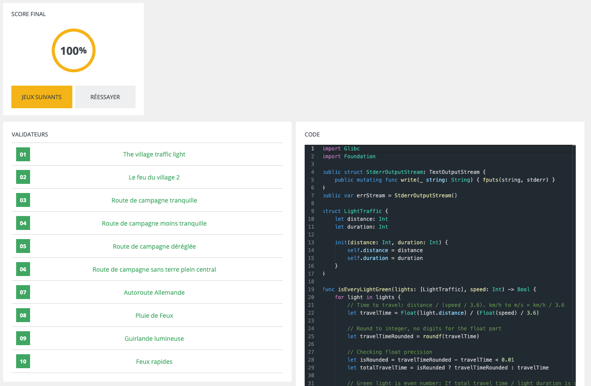
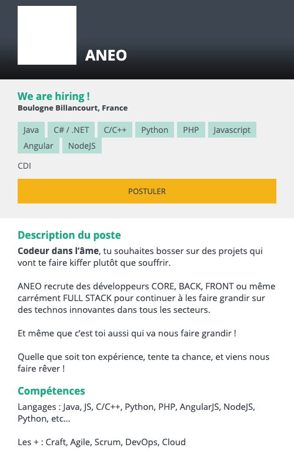
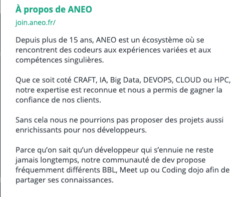
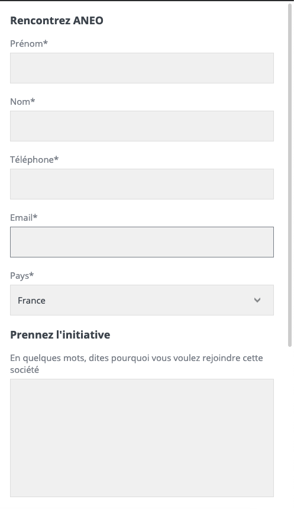

# CodinGame: ANEO Sponsored Challenge

## IMPORTANT

Ce puzzle est un puzzle sponsorisé par une entreprise dans le but de recruter des développeurs, ici ANEO, étant une ESN comme Capgemini, ASTEK, ALTEN, VISEO, AUBAY, Extia, agap2IT,... située à Boulogne-Billancourt (92, Hauts-de-Seine, France). Vous ne pouvez pas dans les puzzles sponsorisés consulter les autres solutions si vous avez résolu le puzzle avec un score de 100%, le but étant de recruter des développeurs opérationnels pour les clients d'ANEO, dans le cadre de missions.

[Site de l'entreprise (à consulter impérativement si vous comptez postuler)](https://www.aneo.eu/)

Si vous réussissez à résoudre ce puzzle à 100%, vous tomberez sur cette interface ci-dessous où vous pourrez soumettre votre candidature spontanée en y déposant votre CV, et en renseignant vos coordonnées, vos disponibilités, un message, et le lien vers votre profil LinkedIn.

### Les détails concernant ANEO
- 
- 

- **En cliquant sur le bouton "Laisser mes coordonnées", voici l'interface pour soumettre sa candidature spontanée:**

### ATTENTION

Ne croyez pas que le fait d'avoir seulement résolu ce puzzle vous permettra d'être embauché, il faudra bien évidemment si vous êtes contacté par les recruteurs d'ANEO:
- Passer des entretiens avec les RH, les ingénieurs d'affaires et potentiellement les directeurs d'agence (en fonction du poste et du processus de recrutement).
- Passer un test recruteur **CodinGame** via la solution **CodinGame FOR WORK**.
- Passer d'autres tests techniques que ce soit par une discussion technique, questions théoriques, mini-projets lors de la rencontre avec un client d'ANEO, si celui-ci accepte de vous rencontrer.

**Et surtout bien vous renseigner sur l'entreprise <u>en interne</u> !!!!**

## ÉNONCÉ

En voiture, vous entrez sur une portion de route et vous comptez vous reposer entièrement sur votre régulateur de vitesse pour traverser la zone sans devoir vous arrêter ni ralentir.

L'objectif est de trouver la vitesse maximale (hors excès de vitesse) qui vous permettra de franchir tous les feux au vert.

*Trouvez une solution, faites-vous contacter et rencontrez l'équipe tech d'ANEO.*

## Objectif

Vous entrez sur une portion de route et vous comptez vous reposer entièrement sur votre régulateur de vitesse pour traverser la zone sans devoir vous arrêter ni ralentir.

L'objectif est de trouver la vitesse maximale (hors excès de vitesse) qui vous permettra de franchir tous les feux au vert.

**Attention:** Vous ne pouvez pas franchir un feu à la seconde où il passe au rouge !

Votre véhicule entre directement dans la zone à la vitesse programmée sur le régulateur et ce dernier veille à ce qu'elle ne change plus par la suite.

## Entrées du jeu

### Entrée

- **Ligne 1:** Un entier `speed` pour la vitesse maximale autorisée sur la portion de route (en km/h).
- **Ligne 2:** Un entier `lightCount` pour le nombre de feu de circulation sur la route.

**`lightCount` prochaines lignes:**
- Un entier `distance` représentant la distance du feu par rapport au point de départ (en mètres).
- Un entier `duration` représentant la durée du feu sur chaque couleur.

Un feu alterne une période de `duration` secondes au vert puis `duration` secondes au rouge.
Tous les feux passent au vert en même temps dès votre entrée dans la zone.

### Sortie
- **Ligne 1:** La vitesse entière (km/h) la plus élevée possible qui permet de franchir tous les feux au vert sans commettre d'excès de vitesse.

### Contraintes
- 1 ≤ `speed` ≤ 200
- 1 ≤ `lightCount` ≤ 9999
- 1 ≤ ``distance` ≤ 99999
- 1 ≤ `duration` ≤ 9999

### Exemple

Entrée | Sortie
------------ | -------------
50 1 200 15 | 50

[Code source de la solution](https://github.com/Kous92/CodinGame-Swift-FR-/blob/main/Puzzles%20classiques/Moyen/ANEO%20Sponsored%20Challenge/aneo.swift)