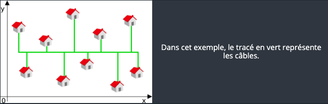

# CodinGame: Câblage réseau

## Que vais-je apprendre ?

Ce puzzle vous permet d’appréhender les bases de l'optimisation d'une valeur, et manipuler des concepts mathématiques (moyenne, médiane, distances, ...).

**Ressources externes: [Médiane](https://fr.wikipedia.org/wiki/M%C3%A9diane_%28statistiques%29), [Distance de Manhattan](https://fr.wikipedia.org/wiki/Distance_de_Manhattan)**

## ÉNONCÉ

Le but de cet exercice est de trouver, s'ils existent, les voisins de droite et d'en bas de chacun des éléments d'un tableau à deux dimensions. La difficulté réside dans le nombre de boucles imbriquées que vous devrez écrire.

## Histoire

Aujourd'hui vous êtes chargé de relier un ensemble de maisons au réseau général. Seulement voilà, votre collègue étourdi a oublié une partie du stock de bobines de câbles avant de partir ce matin. Vous regardez la camionnette à moitié vide en soupirant. Pfff, il va falloir se débrouiller pour utiliser la longueur de câble la plus courte possible.

## Objectifs

Un opérateur Internet projette de raccorder un parc d'entreprises à la fibre optique. La zone à couvrir est large et il vous demande d'écrire un programme qui permettra de calculer la longueur minimale de câble de fibre optique nécessaire pour relier l'ensemble des bâtiments.

## Règles

Pour la mise en œuvre des travaux, l'opérateur a des contraintes techniques qui l'obligent à procéder ainsi :
Un câble principal traversera le parc d'Ouest en Est (depuis la position x du bâtiment le plus à l'Ouest jusqu'à la position x du bâtiment le plus à l'Est).

Pour chaque bâtiment, un câble dédié viendra se relier au câble principal par un chemin minimal (Nord ou Sud), comme le montre cet exemple :

 
La longueur minimale va donc dépendre de la position du câble principal.

## Entrées du jeu

### Entrée

- **Ligne 1:** le nombre `N` de bâtiments à relier à la fibre optique
- **`N` lignes suivantes:** Les coordonnées `x` et `y` des bâtiments.

### Sortie
La longueur minimale `L` de câble nécessaire pour relier tous les bâtiments. Autrement dit, la longueur du câble principal plus celles des câbles dédiés aux bâtiments.

Note : Les bâtiments ayant la même position x ne doivent en aucun cas partager le même câble dédié.
 
### Contraintes
- 0 < `N` ≤ 100000
- 0 ≤ `L` ≤ 2^63
- -2^30 ≤ `x` ≤ 2^30
- -2^30 ≤ `y` ≤ 2^30

### Exemples

[Code source de la solution](https://github.com/Kous92/CodinGame-Swift-FR-/blob/main/Puzzles%20classiques/Moyen/C%C3%A2blage%20r%C3%A9seau/câblageRéseau.swift)