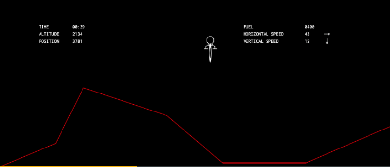
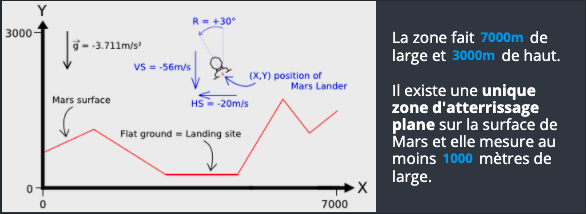
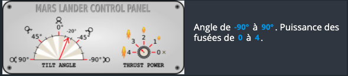
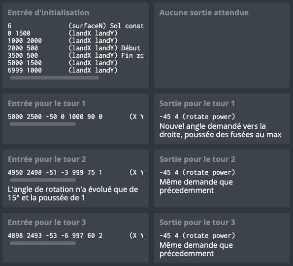

# CodinGame: Mars Lander - Episode 2

## Que vais-je apprendre ?

Dans ce puzzle, itérer sur une série de coordonnées 2D vous aide à appréhender les concepts de comparaisons, calculs de distance, extrapolation. Ce puzzle se base sur des contraintes d'angle et d'orientation. Vous apprenez à calculer la vitesse d'un objet d'après ses coordonnées à deux instants donnés. Avec un peu d'adresse, vous pourrez résoudre ce problème en utilisant des optimisations de trajectoires.

## ÉNONCÉ

Ce puzzle se déroule dans un grand environnement 2D. Vous devez manipuler et extrapoler la position et la vitesse d'un vaisseau spatial afin de le faire atterrir sur un sol plat à la bonne vitesse.

## Histoire

Votre vaisseau d'exploration de Mars vous emmène au-dessus d'une zone rocheuse particulièrement difficile. Il vous faudra revoir et améliorer votre technique d'approche pour vous poser en douceur et sûrement sur le sol martien !

Ce défi moyen est le deuxième d'une série de trois exercices proposés lors du challenge « Mars Lander ». Une fois résolu allez vous confronter au troisième défi [« Mars Lander - Episode 3 »](https://www.codingame.com/training/expert/mars-lander-episode-3) sur le même thème mais avec une difficulté accrue !*

## Objectif

L'objectif de votre programme est de faire atterrir, sans crash, la capsule "Mars Lander" qui contient le rover Opportunity. La capsule “Mars Lander” permettant de débarquer le rover est pilotée par un programme qui échoue trop souvent dans le simulateur de la NASA.

**Ce puzzle est le second niveau de la trilogie "Mars Lander". Les contrôles sont les mêmes que dans le niveau précédent mais vous devez maintenant contrôler l'angle pour réussir.**

## Règles

Sous forme de jeu, le simulateur place Mars Lander dans une zone du ciel de Mars.
- La zone fait **7000m** de large et **3000m** de haut.
- **Pour ce niveau**, Mars Lander se situe au dessus de la zone d’atterrissage, en position verticale, avec aucune vitesse initiale.
- Il existe **une unique zone d'atterrissage plane** sur la surface de Mars et elle mesure au moins **1000 mètres de large**.

Toutes les secondes, en fonction des paramètres d’entrée (position, vitesse, fuel, etc.), le programme doit fournir le nouvel angle de rotation souhaité ainsi que la nouvelle puissance des fusées de Mars Lander:
- Angle de **-90°** à **90°**. Puissance des fusées de **0** à **4**.
- **Pour ce niveau**, vous n'avez besoin de contrôler que la puissance des fusées : l'angle doit rester à 0.

Le jeu modélise **une chute libre** sans atmosphère. La gravité sur Mars est de **3,711 m/s²**. Pour une **puissance des fusées de X**, on génère une poussée équivalente à **X m/s²** et on consomme **X litres de fuel**. Il faut donc une poussée de 4 quasi verticale pour compenser la gravité de Mars.

Pour qu’un atterrissage soit réussi, la capsule doit :
- Atterrir sur un sol plat
- Atterrir dans une position verticale (angle = 0°)
- La vitesse verticale doit être limitée (≤ 40 m/s en valeur absolue)
- La vitesse horizontale doit être limitée (≤ 20 m/s en valeur absolue)

Les validateurs sont différents des tests mais restent très similaires. **Un programme qui passe un test passera le validateur correspondant** sans problème.

## Entrées du jeu

Le programme doit d'abord lire les données d'initialisation depuis l'entrée standard, puis, **dans une boucle infinie**, lire depuis l'entrée standard les données relatives à Mars Lander et fournir sur la sortie standard les instructions de mouvement de Mars Lander.

### Entrées d'initialisation

- **Ligne 1:** le nombre `surfaceN` de points formant le sol de Mars.
- **Les `surfaceN` lignes suivantes :** un couple d'entiers `landX` `landY` donnant les coordonnées d’un point du sol. En reliant les points entre eux de manière séquentielle on obtient la surface de Mars formée de segments. Pour le premier point, `landX` = **0** et pour le dernier point, `landX` = **6999**.

### Entrées pour un tour de jeu
Une **ligne unique** constituée de 7 entiers : `X` `Y` `hSpeed` `vSpeed` `fuel` `rotate` `power`
- `X`, `Y` sont les coordonnées en mètres de la capsule.
- `hSpeed` et `vSpeed` sont respectivement la vitesse horizontale et la vitesse verticale de Mars Lander (en m/s). Suivant le déplacement de Mars Lander, les vitesses peuvent être négatives.
- `fuel` est la quantité de fuel restant en litre. Quand le fuel vient à manquer, la puissance des fusées tombe à zéro.
- `rotate` est l’angle de rotation de Mars Lander en degrés.
- `power` est la puissance des fusées de la capsule.

### Sortie pour un tour de jeu
Une **ligne unique** constituée de **2 entiers** : `rotate` `power`
- `rotate` est l’angle de rotation souhaité pour Mars Lander. À noter que la rotation effective d’un tour à l’autre est limitée à **+/- 15°** par rapport à l’angle du tour précedent.
- `power` est la puissance des fusées. **0** = éteintes. **4** = puissance maximum. La puissance effective d'un tour à l'autre est limitée à **+/- 1**.

### Contraintes
2 ≤ `surfaceN` < 30
0 ≤ `X` < 7000
0 ≤ `Y` < 3000
-500 < `hSpeed`, `vSpeed` < 500
0 ≤ `fuel` ≤ 2000
-90 ≤ `rotate` ≤ 90
0 ≤ `power` ≤ 4
Temps de réponse pour un tour ≤ 100ms

## Exemple

## Synposis

**Même endroit, le lendemain. Vous avez rejoint Jeff et Mike dans la salle de réunion de crise du Kennedy Space Center.**
 
*"Bon je crois que tu as compris le principe. Mike, que penses-tu de notre nouvelle recrue ?"*
*"Il reste du chemin à faire..."*
*"Mike, toujours aussi positif !"*
 
Jeff se tourne vers vous et vous transperce de son regard bleu acier.

*"Cela dit, il n'a pas tort. Ce premier test était juste une mise en jambe. Là tu vas être confronté à des situations plus difficiles. Tu comprends, on doit tout prévoir, le succès de la mission en dépend..."*

[Code source de la solution](https://github.com/Kous92/CodinGame-Swift-FR-/blob/main/Puzzles%20classiques/Moyen/Mars%20Lander%20-%20Episode%202/marsLanderEP2.swift)

**Note: la solution proposée permet aussi de débloquer le succès Or Atteindre les sommets (Réussir le validateur 5 de "Mars Lander - Niveau 2" avec au moins 400l de fuel et un score à 100%.)**