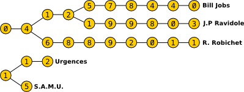

# CodinGame: Numéros de téléphone

## Que vais-je apprendre ?

Dans ce puzzle, vous apprenez de nouvelles façons et des raisons supplémentaires de stocker des données dans des structures optimisées telles que les arbres et obtenez une meilleure compréhension de la théorie des graphes / arbre.

**Ressources externes: [Arbre](https://fr.wikipedia.org/wiki/Arbre_enracin%C3%A9), [Trie](https://fr.wikipedia.org/wiki/Trie_%28informatique%29)**

## ÉNONCÉ

Le but de ce puzzle est de stocker plusieurs numéros de téléphone d'une manière compacte, en utilisant une structure de données d'arbre, puis d'en compter tous les nœuds. Attention, il peut y avoir plusieurs nœuds racine.

## Histoire

Tous ces numéros de téléphone à retenir ! Et si on inventait une nouvelle manière de stocker les numéros en mémoire afin qu'ils prennent le moins de place possible ? C'est à vous qu'incombe cette lourde tâche, mais nous sommes sûrs que vous réussirez sans problème à surmonter ce défi. On s'appelle ?

## Objectif

En rejoignant l’équipe de développement du smartphone iDroid, on vous a confié la responsabilité de développer le gestionnaire de contacts. Évidement, ce qu’on a oublié de vous préciser c’est que sur l’iDroid les contraintes techniques sont fortes : le système dispose de peu de mémoire et le processeur est aussi véloce qu’un Cyrix des années 90...

Dans le cahier des charges, deux points retiennent votre attention :

1. **Assistance intelligente à la saisie des numéros**
Le ou les numéros correspondant aux premiers chiffres saisis devront être affichés à l’utilisateur, quasi instantanément.

2. **Optimisation du stockage des numéros**
Les premiers chiffres communs aux numéros ne devront pas être dupliqués en mémoire.

Heureusement, les spécifications présentent aussi ce petit diagramme pour vous guider dans l’implémentation :

Votre mission : écrire un programme qui affiche le nombre d'éléments (qui représentent des chiffres) nécessaires pour stocker une liste de numéros de téléphone avec la structure présentée ci-dessus.

## Entrées du jeu

### Entrée
- **Ligne 1:** le nombre `N` de numéros de téléphone.
- **`N` Lignes suivantes:** Chaque ligne contient un numéro de téléphone de longueur maximum `L`. Les numéros de téléphone sont uniquement composés des chiffres **0** à **9** inclus, sans espaces.

### Sortie
Le nombre d'éléments (référençant un chiffre) stockés par la structure.
 
### Contraintes
0 ≤ `N` ≤ 10000
2 ≤ `L` ≤ 20

### Exemples

1. 
Entrée | Sortie
------------ | -------------
1 0467123456 | 10

2. 
Entrée | Sortie
------------ | -------------
2 0123456789 1123456789 | 20

3. 
Entrée | Sortie
------------ | -------------
2 0123456789 0123 | 10

4. 
Entrée | Sortie
------------ | -------------
5 0412578440 0412199803 0468892011 112 15 | 28

[Code source de la solution](https://github.com/Kous92/CodinGame-Swift-FR-/tree/main/Puzzles%20classiques/Moyen/Num%C3%A9ros%20de%20t%C3%A9l%C3%A9phone/num%C3%A9rosDeT%C3%A9l%C3%A9phone.swift)