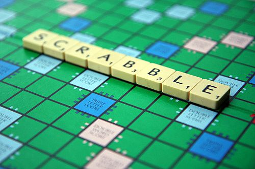

# CodinGame: Scrabble

## Que vais-je apprendre ?
Ce puzzle vous demande d'utiliser des boucles imbriquées ainsi que de combiner plusieurs tableaux associatifs afin de construire une solution efficacement.

**Ressources externes: [Tableau associatif](https://fr.wikipedia.org/wiki/Table_de_hachage), [Tableau associatif](https://fr.wikipedia.org/wiki/Tableau_associatif)**

## ÉNONCÉ

Le but de ce problème est de manipuler des mots dans un dictionnaire afin de trouver le meilleur score au jeu populaire Scrabble. Souvent, le choix des structures de données est la clé pour résoudre un puzzle.

## Histoire

Quand vous jouez au scrabble le dimanche en famille, la situation dégénère souvent très vite. Quel est le meilleur coup à jouer ? Faut-il poser "Flasque" ou "Flaques" ? Que va faire grand-mère au coup prochain ? Nous vous proposons un exercice pour calculer quel est le meilleur mot à jouer parmi une liste de mot possibles.

## Objectif

Lorsqu'on joue au Scrabble©, chaque joueur tire 7 lettres et doit trouver le mot qui permet d'obtenir le meilleur score en utilisant ces lettres.

Un joueur n'a pas l'obligation de former un mot de 7 lettres, le mot peut être plus court. La seule contrainte est que le mot ne peut être constitué que des lettres que le joueur a tiré.

Par exemple, avec les lettres `etaenhs`, les mots possibles (en anglais) sont : `ethane`, `hates`, `sane`, `ant`.

Votre objectif est de trouver le mot qui marque le plus de points en utilisant les lettres disponibles (1 à 7 lettres).

## Règles

Au Scrabble©, chaque lettre est pondéré par un score qui dépend de la difficulté à utiliser cette lettre dans un mot. Vous pouvez voir ci-dessous un tableau indiquant les points que peuvent rapporter chaque lettre :
 
| Lettres | Points |
| --------- | ---------- |
| `e`, `a`, `i`, `o`, `n`, `r`, `t`, `l`, `s`, `u` | 1 |
| `d`, `g` | 2 |
| `b`, `c`, `m`, `p` | 3 |
| `f`, `h`, `v`, `w`, `y` | 4 |
| `k` | 5 |
| `j`, `x` | 8 |
| `q`, `z` | 10 |

Le mot `banjo` vous rapporte 3 + 1 + 1 + 8 + 1 = 14 points.

Un dictionnaire des mots autorisé est fourni en entrée de votre programme. Le programme doit alors trouver le mot de ce dictionnaire qui rapporte le plus de points pour les sept lettres données (une lettre ne peut être utilisée qu'une seule fois). Si deux mots rapportent le même nombre de points, alors le mot qui apparaît le premier dans le dictionnaire fourni sera choisi.
 

Les mots sont composés uniquement de lettres de l'alphabet en minuscule. On garantit également l'existence d'au moins un mot possible.

## Entrées du jeu

### Entrée

- **Ligne 1:** le nombre `N` de mots du dictionnaire
- **Les `N` lignes suivantes:** les mots du dictionnaire. Un mot par ligne.
- **Dernière ligne:** les 7 lettres restantes.

### Sortie
Le mot qui rapporte le plus de points en utilisant les lettres disponibles (1 à 7 lettres). Le mot doit appartenir au dictionnaire. Chaque lettre ne peut être utilisé qu'une seule fois dans la solution. Il y a toujours une solution.
 
### Contraintes
- 0 < `N` < 100000
- Les mots du dictionnaire ont au maximum une longueur de 30 caractères.

### Exemples
Entrée | Sortie
------------ | -------------
5 because first these could which hicquwh | which

[Code source de la solution](https://github.com/Kous92/CodinGame-Swift-FR-/tree/main/Puzzles%20classiques/Moyen/Scrabble/scrabble.swift)