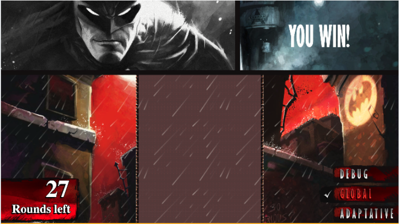
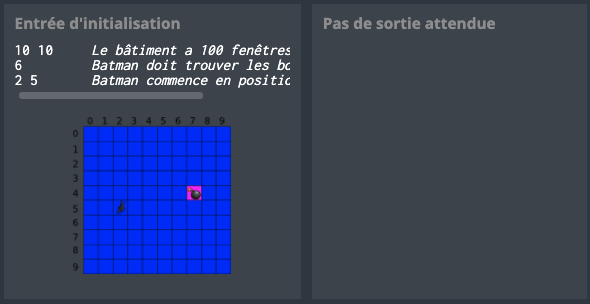
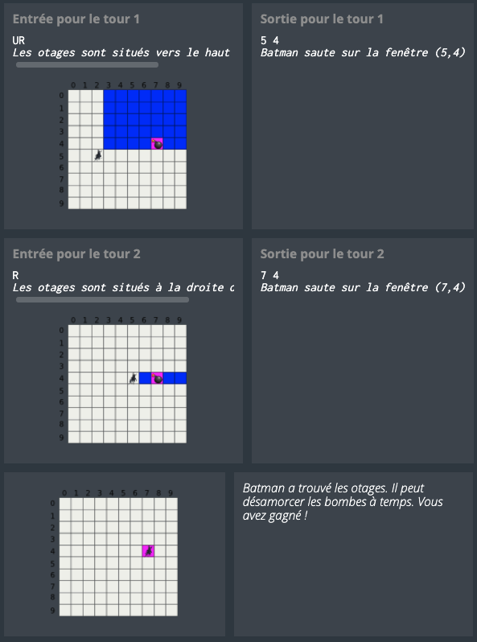

# CodinGame: Shadows of the Knight - Episode 1

## Que vais-je apprendre ?

Vous devez gérer des index et des tableaux à deux dimensions avec ce puzzle. Vous découvrez aussi l'algorithme de recherche dichotomique et surtout, vous réalisez aussi que Batman est vraiment bon dans le nettoyage de fenêtres.

**Ressources externes: [Tableau à plusieurs dimensions](https://fr.wikipedia.org/wiki/Tableau_(structure_de_donn%C3%A9es)#Tableau_.C3.A0_deux_dimensions_.28ou_plus.29), [Recherche dichotomique](https://fr.wikipedia.org/wiki/Recherche_dichotomique), [(EN) 2D Binary Search explained by Gaurav Sen](https://www.youtube.com/watch?v=4R9PyTvcWE0)**

## ÉNONCÉ

Le but de ce puzzle est de trouver la coordonnée d'une bombe (ligne et colonne d'un tableau à deux dimensions). Vous devrez faire une proposition à chaque étape du puzzle et l'ajuster en fonction du résultat. Bien sûr, il y a un nombre limite de propositions.

## HISTOIRE

*NA NA NA NA NA BATMAN*

Une aventure de Batman comme on les aime: le Joker, des bombes, des otages, un compte à rebours, et un héros. Le héros, c'est vous. A vous de retrouver et désamorcer les bombes avant qu'elles n'explosent ! Alfred a tout prévu pour cela, et vous confie un détecteur de chaleur réglé sur la signature thermique des bombes du Joker. Facile ? On va voir.

*Ce défi moyen est le premier d'une série de deux exercices proposés lors du challenge « Shadows of the Knight ». Une fois résolu, pourquoi ne pas tenter de coder le niveau suivant, [« Shadows Of The Knight - Episode 2 »](https://www.codingame.com/training/expert/shadows-of-the-knight-episode-2), sur le même thème mais avec une difficulté accrue.*

## Objectifs

Batman va rechercher les otages d'un batiment donné en sautant de fenêtre en fenêtre à l'aide de son grappin. Le but de Batman est d'arriver sur la fenêtre de la pièce où les otages se trouvent afin de désamorcer les bombes du Joker. Malheureusement il n'a qu'un nombre de sauts limités avant que les bombes n'explosent...

## Règles

Avant chaque saut, le détecteur fournira à Batman la direction des bombes par rapport à la position actuelle de Batman:
- `U` (Up : les bombes sont situées au dessus de Batman)
- `UR` (Up-Right : les bombes sont situées au dessus et à droite de Batman)
- `R` (Right : les bombes sont situées à droite de Batman)
- `DR` (Down-Right : les bombes sont situées en dessous et à droite de Batman)
- `D` (Down : les bombes sont situées en dessous de Batman)
- `DL` (Down-Left : les bombes sont situées en dessous et à gauche de Batman)
- `L` (Left : les bombes sont situées à gauche de Batman)
- `UL` (Up-Left : les bombes sont situées au dessus et à gauche de Batman)

Votre mission consiste à programmer le détecteur afin **qu'il indique la position de la fenêtre sur laquelle Batman devra se rendre au saut suivant** de sorte qu'il atteigne les bombes **le plus tôt possible**.

Les bâtiments sont représentés par des rectangles de fenêtres, la fenêtre **en haut à gauche a pour position (0,0).**

## Note
Pour certains tests, la position **des bombes varie d'une exécution à l'autre**. L'objectif est de vous aider à trouver le meilleur algorithme possible.
Les tests fournis et les validateurs utilisés pour le calcul du score sont similaires mais différents.

## Entrées du jeu
Le programme doit d'abord lire les données d'initialisation depuis l'entrée standard, puis, dans une boucle infinie, lire depuis l'entrée standard les données relatives à l'état courant de Batman et fournir sur la sortie standard les données demandées.

### Entrées d'initialisation
- **Ligne 1:** 2 entiers `W` `H`. Le couple (`W`,`H`) représente la largeur et la hauteur du batiment en nombre de fenêtre
- **Ligne 2:** 1 entier `N`, qui représente le nombre de sauts que Batman peut faire avant que les bombes n'explosent.
- **Ligne 3:** 2 entiers `X0` `Y0`, qui représentent la position de départ de Batman.

### Entrée pour un tour de jeu
Une ligne unique donnant le code du détecteur : **`COLDER`** **`WARMER`** **`SAME`** ou **`UNKNOWN`**

### Sortie pour un tour de jeu
Une **ligne unique** avec 2 entiers `X` `Y` séparés par un espace. (`X`,`Y`) représente la position de la prochaine fenêtre sur laquelle Batman devrait sauter. `X` représente l'index sur l'axe horizontal, `Y` représente l'index sur l'axe vertical. (0,0) se trouve dans le coin haut gauche du bâtiment.

### Sortie
- Ligne 1: La différence `D` entre les deux puissances les plus proches. `D` est un entier positif.

### Contraintes
- 1 ≤ `W` ≤ 10000
- 1 ≤ `H` ≤ 10000
- 2 ≤ `N` ≤ 100
- 0 ≤ `X`, `X0` < W
- 0 ≤ `Y`, `Y0` < H
- Temps de réponse pour un tour ≤ 150ms

### Exemples
- Initialisation: 

- Tours de jeu: 

### Synopsis

**Batman:** “Allez Joker, c'est fini, sors de ta cachette ! Tu ne peux plus m'échapper maintenant...” 
**Joker:** “Oh que si Batman ! Regarde derrière toi... Tu vois ces batiments ? Et bien dans chacun d'eux il y a une pièce pleine d'otages attachés à mes adorables bombes-surprises. Elles peuvent exploser à tout moment, quel joyeux feu d'artifice ce sera ! BOUM, BOUM, BOUM !!!” 
**Batman:** “Sois maudit, Joker, tu ne t'en tireras pas comme ça.” 
**Joker:** “À toi de choisir Batman : perdre ton temps à essayer de m'attraper ou tenter de sauver ces pauvres otages innocents ? Ha ha ha...” 
**Batman:** “Alfred, je n'ai pas le temps de vérifier toutes les fenêtres des batiments: j'ai besoin d'un gadget pour accélérer la tâche.” 
**Alfred:** “Bien sûr monsieur. J'ai justement l'outil idéal : un détecteur de bombes basé sur la chaleur émise par les explosifs. Je vous l'envoie dès que j'ai fini de le reprogrammer.” 
**Joker:** “À plus tard Batman ! Ha ha ha HI HI HI...” 

[Code source de la solution](https://github.com/Kous92/CodinGame-Swift-FR-/blob/main/Puzzles%20classiques/Moyen/Shadows%20of%20the%20Knight%20-%20Episode%201/shadowsOfTheKnightEP1.swift)