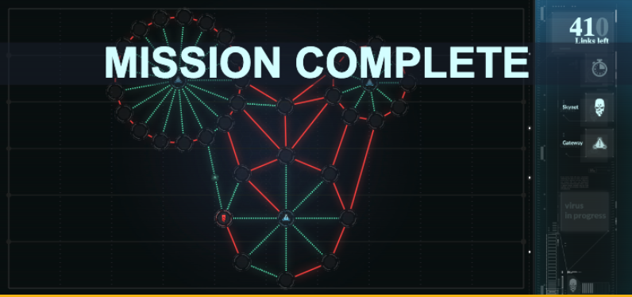
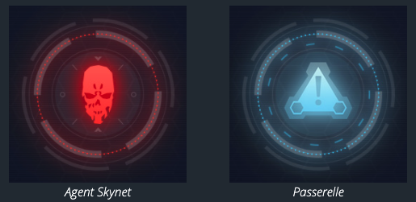
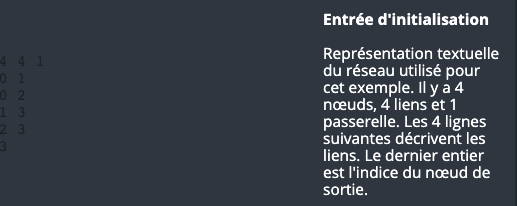
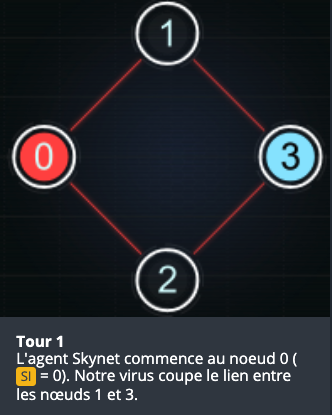
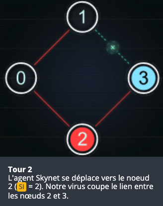
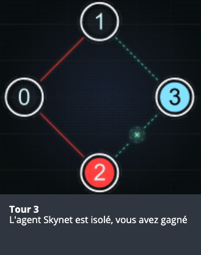

# CodinGame: Skynet Revolution - Episode 1

## Que vais-je apprendre ?

Avec ce puzzle, vous apprenez à stocker des données sous la forme d'un graphe. En cherchant et modifiant le graphe que vous aurez créé, vous pourrez vous initier à la théorie des graphes de manière appliquée.

**Ressources externes: [Théorie des graphes](https://fr.wikipedia.org/wiki/Th%C3%A9orie_des_graphes), [Parcours en largeur (BFS)](https://fr.wikipedia.org/wiki/Algorithme_de_parcours_en_largeur)**

## ÉNONCÉ

Ce problème se déroule sur un réseau où un "virus" se déplace de nœud en nœud, cherchant une sortie. Il y a plusieurs sorties et vous devez couper un à un les accès à ces sorties, en cherchant le meilleur accès à couper à chaque tour.

## Histoire

Le virus de la résistance se propage à travers le réseau Skynet. Mais Skynet se défend ! Empêchez Skynet de détruire le virus en coupant les bons liens du réseau...

*Ce défi facile est le premier d'une série de deux exercices proposés lors du challenge « Skynet - Le Final ». Une fois résolu allez vous confronter au deuxième défi [« Skynet Revolution - Episode 2 »](https://www.codingame.com/training/hard/skynet-revolution-episode-2) sur le même thème mais avec une difficulté accrue !*

## Objectif

Votre virus a créé une backdoor sur le réseau Skynet vous permettant d'envoyer de nouvelles instructions au virus en temps réél.

Vous décidez de passer à l'attaque active en **empêchant Skynet de communiquer sur son propre réseau interne.**

Le réseau Skynet est divisé en sous-réseaux. Sur chaque sous-réseau un agent Skynet a pour tâche de transmettre de l'information en se déplaçant de noeud en noeud le long de liens et **d'atteindre une des passerelles qui mène vers un autre sous-réseau.**

Votre mission est de reprogrammer le virus pour **qu'il coupe les liens** dans le but d'empêcher l'agent Skynet de sortir de son sous-réseau et ainsi d'informer le hub central de la présence de notre virus.

## Règles

Pour chaque test on vous fournit :
- La carte du sous-réseau.
- L'emplacement des passerelles de sortie.
- L'emplacement de départ de l'agent Skynet.
**>>> Au maximum, un noeud du réseau ne peut être lié qu'à une seule passerelle. <<<**

À chaque tour de jeu :
- Dans un premier temps, vous coupez un des liens du sous-réseau.
- Ensuite l'agent Skynet se déplace vers un noeud du réseau encore accessible.

### 🏆 Conditions de victoire
L'agent Skynet ne peut plus atteindre aucune passerelle

### 💀 Conditions de défaite
L'agent Skynet atteint une passerelle

### Exemple
- Entrée d'initialisation 

- 1: Tour 1 

- 2: Tour 2 

- 3: Tour 3 

## Note

Les tests fournis et les validateurs utilisés pour le calcul du score sont similaires mais différents.

## Entrées du jeu

Le programme doit d'abord lire les données d'initialisation depuis l'entrée standard, puis, dans une boucle infinie, lire depuis l'entrée standard les données relatives à l'état courant de l'agent Skynet et fournir sur la sortie standard les instructions à destination du virus.

### Entrées d'initialisation

- **Ligne 1:** 3 entiers `N` `L` `E`.
    + `N`, représente le nombre de noeuds (y compris les passerelles) du sous-réseau.
    + `L`, représente le nombre de liens du sous-réseau.
    + `E`, indique le nombre de passerelles du réseau.
- Les `L` lignes suivantes : 2 entiers par ligne (`N1`, `N2`), indiquant la présence d'un lien entre le noeud d'index `N1` et le noeud d'index `N2` du réseau
- Les `E` lignes suivantes : 1 entier `EI` représentant l'index d'une passerelle de sortie du réseau.

### Entrée pour un tour de jeu
- **Ligne 1:** 1 entier `SI` qui est la position de l'agent Skynet sur le sous-réseau (indice du nœud).

### Sortie pour un tour de jeu
Une **ligne unique** composée de deux entiers `C1` et `C2` séparés par un espace. Ces deux entiers représentent les indices des deux noeuds reliés par le lien du sous-réseau à couper.

### Contraintes
- 2 ≤ `N` ≤ 500
- 1 ≤ `L` ≤ 1000
- 1 ≤ `E` ≤ 20
- 0 ≤ `N1`, `N2` < `N`
- 0 ≤ `SI` < `N`
- 0 ≤ `C1`, `C2` < `N`
- Temps de réponse pour un tour ≤ 150ms

## Synposis

**SKYNET LE FINAL - NIVEAU 1**

**Los Angeles 2029 - QG de la Résistance - Rappel des faits :**

*Samedi dernier, des centaines de valeureux combattants ont risqué leur vie pour détruire Skynet. STOP*

*En utilisant des Moto-Terminators contaminées, ils sont parvenus à inoculer à Skynet un virus fatal. STOP*

*Problème: Skynet riposte. STOP*

*John, nous avons encore besoin de vous. STOP*

[Code source de la solution](https://github.com/Kous92/CodinGame-Swift-FR-/blob/main/Puzzles%20classiques/Moyen/Skynet%20Revolution%20-%20Episode%201/skynetRevolution1.swift)

**Note: la solution proposée permet aussi de débloquer le succès Or Embuscade (Résoudre le défi à 100% et le 4ème test du problème "Skynet : le virus" avec plus de 50 liens restants.)**