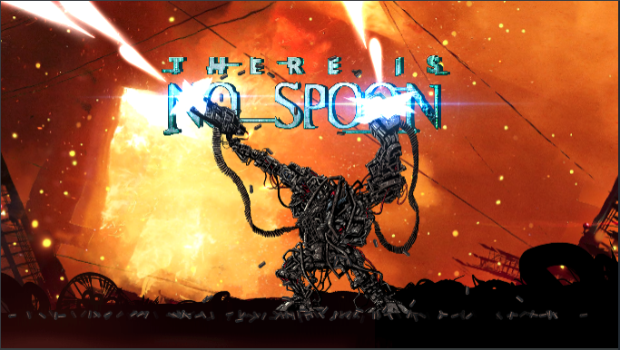
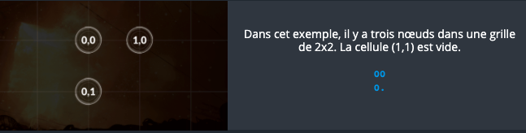
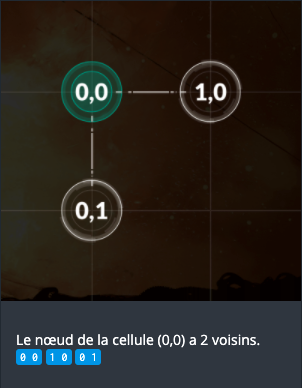
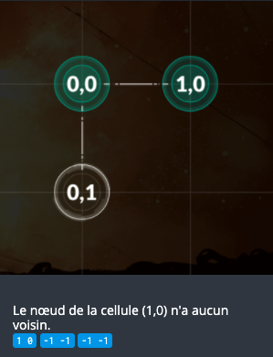
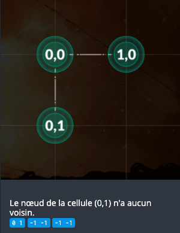

# CodinGame: There is no Spoon - Episode 1

## Que vais-je apprendre ?

Dans ce puzzle, vous devez détecter des caractères spéciaux dans une chaîne (string). Vous devez stocker certaines de ces données sous forme de grille afin de pouvoir l'explorer. Pour chacun de ces éléments, vous devez itérer une deuxième fois afin de trouver les éléments de la grille requis. Résoudre ce puzzle vous apprend le concept de boucles imbriquées.

**Ressources externes: [Tableau à plusieurs dimensions](https://fr.wikipedia.org/wiki/Tableau_(structure_de_donn%C3%A9es)#Tableau_.C3.A0_deux_dimensions_.28ou_plus.29), [Boucles](https://fr.wikipedia.org/wiki/Structure_de_contr%C3%B4le#Boucles)**

## ÉNONCÉ

Le but de cet exercice est de trouver, s'ils existent, les voisins de droite et d'en bas de chacun des éléments d'un tableau à deux dimensions. La difficulté réside dans le nombre de boucles imbriquées que vous devrez écrire.

## Histoire

Sion est attaquée de toutes parts ! Les humains libres comptent sur vous pour recoder le mécanisme d'armement des APUs (Armored Personal Unit) et donner à l'humanité un avantage décisif. Première phase : coder le mécanisme d'initialisation de l'APU.

*Ce défi fait partie d'une série de deux exercices proposés lors du challenge « There is no Spoon ». Une fois résolu, dirigez-vous vers le défi [« There Is No Spoon - Episode 2 (Difficulté: DIFFICILE»](https://www.codingame.com/training/hard/there-is-no-spoon-episode-2) où les choses vont largement se compliquer !*

## Objectifs

Le jeu se joue sur une grille rectangulaire de taille variable représentant une micro-puce. Certaines cellules de la grille contiennent des nœuds d'alimentation. Les autres cellules sont vides.

Le but est d'indiquer, s'ils existent, le voisin horizontal et le voisin vertical de chaque nœud d'alimentation.

## Règles
Pour ce faire, vous devez trouver chaque nœud de coordonnées (x1,y1) et afficher les coordonnées (x2,y2) du premier nœud situé **sur sa droite** et les coordonnées (x3,y3) du premier nœud situé **sous lui** dans la grille.

**Si un voisin n'existe pas**, vous devez afficher les coordonnées `-1` `-1` en lieu et place des coordonnées (x2,y2) et/ou (x3,y3).

Vous **perdez** si :
- Vous indiquez un voisin incorrect pour un nœud donné.
- Vous indiquez un voisin pour une cellule vide.
- Vous fournissez deux fois les voisins d'un nœud donné.
- Vous oubliez un nœud dans votre liste.

### 🏆 Conditions de victoire
Vous gagnez la partie quand tous les voisins de tous les nœuds ont été affichés de manière correcte.

## Exemples
- 1: 3 nœuds dans une grille de 2x2. La cellule (1, 1) est vide. 

- 2: Le nœud de la cellule (0,0) a 2 voisins. 

- 3: Le nœud de la cellule (1,0) n'a aucun voisin. 

- 4: Le nœud de la cellule (0,1) n'a aucun voisin. 

## Note

N'oubliez pas d'exécuter les tests depuis la fenêtre "Jeu de tests".

**Attention:** les tests fournis et les validateurs utilisés pour le calcul du score final sont similaires mais **différents** (pas de points pour les solutions "hardcodées").

Remarque concernant le visualisateur:
- Le mode debug est accessible depuis le panneau des options (roue dentée)
- Vous pouvez zoomer/dézoomer avec la molette et vous déplacer par drag'n drop (utile pour les grandes grilles)

## Entrées du jeu

Votre programme doit d'abord lire les données d'initialisation depuis l'entrée standard, puis écrire sur la sortie standard les données demandées.

### Entrées d'initialisation
- **Ligne 1:** un entier `width` indiquant la largeur de la grille (axe des x).
- **Ligne 2:** un entier `height` indiquant la hauteur de la grille (axe des y). La coordonnée (0,0) indique la cellule située en haut à gauche de la grille.
- **Les `height` Lignes suivantes:** une chaîne de caractères `line` de longueur `width` représentant une ligne de la grille. Un point **.** représente une cellule vide. Un zéro **0** représente une cellule contenant un nœud.

### Sortie pour un tour de jeu
- **Une ligne par nœud:** Sur chaque ligne, une suite de six entiers: `x1`  `y1`  `x2`  `y2`  `x3`  `y3`

Avec:
- (x1,y1) désignent les coordonnées du nœud
- (x2,y2) désignent les coordonnées du voisin de droite du nœud.
- (x2,y3) désignent les coordonnées du voisin vertical situé en dessous du nœud.
En l'absence de voisin, les coordonnées à afficher sont **-1 -1**
 
### Contraintes
- 0 < `width` ≤ 30
- 0 < `height` ≤ 30
- 0 ≤ `x1` < `width`
- 0 ≤ `y1` < `height`
- -1 ≤ `x2`, `x3` < `width`
- -1 ≤ `y2`, `y3` < `height`
- Temps de réponse première ligne ≤ 1s
- Temps de réponse entre chaque ligne ≤ 150ms

### Synopsis

**25 avril 2699, 18:01 - Les machines se rapprochent de Sion...**

... et les humains libres préparent leur ultime bataille.

L'armée de résistance est constituée d'APUs (Armored Personal Unit). L’APU est un immense exosquelette dans lequel se fond un soldat-opérateur. Chacun des mouvements de l'exosquelette se calque sur les mouvements de l’opérateur créant ainsi un super-soldat de métal. *Une machine... mais une machine aux ordres comme devraient l'être toutes les machines...*

L'APU est équipé de deux canons mitrailleurs ultra-rapides de 30 mm déclenchés par des capteurs de pression situés au niveau des doigts de l'opérateur. Chaque APU contient une micro-puce 'R'. La micro-puce gère le flux de munitions injectées dans les canons et empêche ceux-ci de s'enrayer.

En tant que meilleur programmeur de Sion – 1er au précédent challenge CodinGame – on vous demande d'améliorer la micro-puce pour augmenter le débit du tir.

Grisé à l'idée de devenir un héros de la victoire contre les machines, vous décidez de faire table rase du précédent programme et de réécrire l'ensemble des routines de la puce.

Première tâche: **recoder la procédure d'initialisation de la micro-puce 'R'**. À l'allumage du système, la puce vérifie la validité des connexions internes entre les nœuds d'alimentation de l'APU. Cette vérification permet l'activation du système de tir. Si cette routine d'initialisation n'est pas parfaitement fonctionnelle, de nombreux combattants mourront sans avoir pu tirer une seule fois.

**L'humanité compte sur vous. ¡No pasarán!**

[Code source de la solution](https://github.com/Kous92/CodinGame-Swift-FR-/tree/main/Puzzles%20classiques/Moyen/There%20is%20no%20Spoon%20-%20Episode%201/thereIsNoSpoon1.swift)