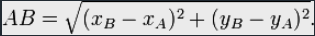

# CodinGame: Shadows of the Knight - Episode 2

## Que vais-je apprendre ?

Dans ce puzzle, vous devez effectuer des calculs sur une grille qui est trop large pour être entièrement stockée. Vous apprenez à implémenter un algorithme efficace de recherche dichotomique.

**Ressources externes: [Recherche dichotomique](https://fr.wikipedia.org/wiki/Recherche_dichotomique), [Trilatération](https://fr.wikipedia.org/wiki/Trilat%C3%A9ration)**

## ÉNONCÉ

Afin de trouver une coordonnée correcte sur une grille, vous devez implémenter une recherche dichotomique ou utiliser la trilatération. La grille peut être très large dans certains cas ce qui vous oblige à optimiser votre code.

## HISTOIRE

Le Joker est toujours en fuite ! En parlant de fuite, ça sent le gaz. Une nouvelle série de bombes a été placée dans les immeubles de la cité par le Joker. Armé du tout nouveau détecteur d'Alfred, ALF2.0, il vous faudra jouer des pieds et des mains pour escalader ces immeubles et aller désamorcer les bombes.

*Ce défi difficile est le second des deux exercices proposés lors du challenge « Shadows of the Knight ». Avant de vous y essayer, pensez à regarder le niveau précédent, [« Shadows of the Knight - Episode 1 »](https://www.codingame.com/training/medium/shadows-of-the-knight-episode-1), sur le même thème mais avec une difficulté moindre.*

## Objectifs

En raison du bouclier thermique, le détecteur ne peut plus fournir la direction des bombes : il indique uniquement si Batman se rapproche ou s'éloigne des bombes.

## Règles

Après chaque saut, le nouveau détecteur fournit un des codes suivants :
- **`COLDER`**: Batman est plus loin des bombes qu'il ne l'était avant son saut.
- **`WARMER`**: Batman est plus proche des bombes qu'il ne l'était avant son saut.
- **`SAME`**: Batman est à la même distance des bombes qu'il ne l'était avant son saut.
- **`UNKNOWN`**: Envoyé uniquement avant le premier saut : le détecteur ne peut rien indiquer. 
La distance utilisée pour la notion de plus proche / plus loin est la distance euclidienne:
 

Comme pour la question précédente, votre mission consiste à programmer le détecteur afin **qu'il indique la position de la fenêtre sur laquelle Batman devra se rendre au saut suivant** de sorte qu'il atteigne les bombes **le plus tôt possible.**

Les bâtiments sont représentés par des rectangles de fenêtres, la fenêtre en haut à gauche a pour position (0,0).

## Note
Pour certains tests, la position **des bombes varie d'une exécution à l'autre**. L'objectif est de vous aider à trouver le meilleur algorithme possible.
Les tests fournis et les validateurs utilisés pour le calcul du score sont similaires mais différents.

## Entrées du jeu
Le programme doit d'abord lire les données d'initialisation depuis l'entrée standard, puis, dans une boucle infinie, lire depuis l'entrée standard les données relatives à l'état courant de Batman et fournir sur la sortie standard les données demandées.

### Entrées d'initialisation
- **Ligne 1:** 2 entiers `W` `H`. Le couple (`W`,`H`) représente la largeur et la hauteur du batiment en nombre de fenêtre
- **Ligne 2:** 1 entier `N`, qui représente le nombre de sauts que Batman peut faire avant que les bombes n'explosent.
- **Ligne 3:** 2 entiers `X0` `Y0`, qui représentent la position de départ de Batman.

### Entrée pour un tour de jeu
Une ligne unique donnant le code du détecteur : **`COLDER`** **`WARMER`** **`SAME`** ou **`UNKNOWN`**

### Sortie pour un tour de jeu
Une **ligne unique** avec 2 entiers `X` `Y` séparés par un espace. (`X`,`Y`) représente la position de la prochaine fenêtre sur laquelle Batman devrait sauter. `X` représente l'index sur l'axe horizontal, `Y` représente l'index sur l'axe vertical. (0,0) se trouve dans le coin haut gauche du bâtiment.

### Contraintes
- 1 ≤ `W` ≤ 10000
- 1 ≤ `H` ≤ 10000
- 2 ≤ `N` ≤ 100
- 0 ≤ `X`, `X0` < W
- 0 ≤ `Y`, `Y0` < H
- Temps de réponse pour un tour ≤ 150ms

### Synopsis
**Joker**: “NON NON NON ! Tu as gâché la fête Batman ! C'est injuste, tu as encore utilisé tes satanés gadgets. Tu n'es qu'un tricheur !” 
**Batman**: “Et toi un mauvais perdant, Joker. Rends-toi ! Maintenant !” 
**Joker**: “Pas encore Batman ! J'ai ajouté un bouclier thermique sur mes bombes. Voyons comment tu t'en sors sans l'aide de ton précieux détecteur ! Hi hi hi” 
**Batman**: “Alfred, le détecteur ne fonctionne plus. Il faut le modifier rapidement pour que je puisse sauver les derniers otages.” 
**Alfred**: “Tout à fait monsieur. Je vous envoie une nouvelle version dès que j'ai fini de la reprogrammer.” 
**Joker**: “Hiiii hi hi, Haaaa ha ha, HO HO HOOOOO ...” 

[Code source de la solution](https://github.com/Kous92/CodinGame-Swift-FR-/blob/main/Puzzles%20classiques/Tr%C3%A8s%20difficile/Shadows%20of%20the%20Knight%20-%20Episode%202/shadowsOfTheKnightEP2.swift)

**Note: la solution proposée permet aussi de débloquer le succès Légende Triple saut (Résoudre le défi à 100% et le 8ème test du défi "Triangulation" avec au moins 3 sauts restants.)**